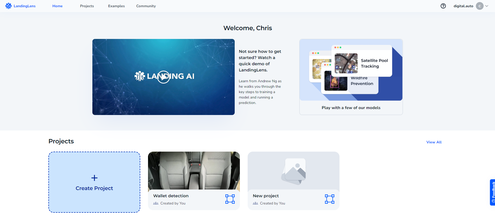
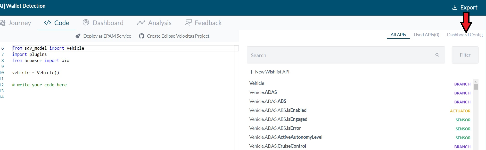

  

  
  

## Landing AI Platform Model build up and digital.auto Playground Deployment Guide

Here we take [**Wallet Detection**](https://digitalauto.netlify.app/model/uRApzeqYHTGpdDSUhA3X/library/prototype/9RjCbSGC94xsuo7awzkB/view/run) demo case on [**digital.auto Playground**](https://digitalauto.netlify.app/), as an example, to demonstrate how to create an AI-related Software-defined Vehicle prototype. The process is divided into two main parts, building an object detection AI model on the Landing AI platform [**LandingLens**](https://landing.ai/) from scratch and deploying this model on digital.auto Playground. 

### 1. LandingLens AI model build up

#### 1.1 Register a LandingLens account and create an AI project
* Register an account at Landing AI homepage (https://app.landing.ai/login).
  

* After entering your personal account home page, click on **Create Project** tile to create your project.
  

* After entering your created project, click on **Edit** icon  and enter a descriptive name for your project.
  

#### 1.2 Select your project type
* Three main Computer Vision related tasks that can be developed on LandingLens: 
  * Object Detection: I want to identify objects by drawing boxes around them.
  * Segmentation: I want to identify objects by painting pixels on them.
  * Classification: I want to identify each image into different categories.
* For **Wallet Detection** project, we select the project type of Object detection.

#### 1.3 Upload your image dataset 
* If you have labeled image datasets, you can upload them by selecting drop to upload button. 
  * Drag the image dataset to LandingLens on the upload image page.
    
  * After uploading your dataset to LandingLens, the images will be automatically annotated.
    
* If you only have some raw images without labeling, you can utilize LandingLens online annotation tool to label your images. 
  * Update your raw images to LandingLens as before, then click one image to enter the annotation editor.
    
  * Click on **+ Create Class** to define the item you want to detect into a class, e.g., Wallet.   
     
  *  You can label your images by drawing a box on the object that you want to identify, then press the left or right arrow keys on your keyboard accordingly to move to the next image.
     

  * If the image does not have any items to label, then click **Nothing to Label** on the bottom right corner.

#### 1.4 Train your model online
  * After you prepare your dataset on LandingLens, click the **Train** button to start training your customized wallet detection model, which will take a few minutes.
  
#### 1.5 Generate your model API key
* Click on **Deploy** button in the left menu, then click on **Create new endpoint** and deploy. Give a name and click **Create** button to create your endpoint.
* Select **View API Key**, enter the name, and click **Generate API Key** to generate your personalized API key. Later during the deployment of digital.auto Playground, you will use API calls to send images by specifying your API key. 
  

### 2. digital.auto Playground integration

In this section, the integration processes of the AI model from LandingLens on digital.auto Playground will be introduced. We will deploy four widgets (two for the raw image and two for the AI inference results) on the vehicle model Dashboard on Playground to demonstrate Wallet Detection use case. 

#### 2.1 Login to the digital.auto playground portal
* Click this link https://digitalauto.netlify.app/ to visit digital.auto playground portal on your web browser.
* Login with your user email ID and password. (Please send an email to chris.cheng@ferdinand-steinbeis-institut.de to request an account)

#### 2.2 Choose your vehicle model
* Click on **Select Model** button; thus, all public vehicle models are visible.
  

* Click on the vehicle model **Industrial Internet**. 
  

#### 2.3 Create your Software-defined Vehicle prototype
* Click **Prototype Library** to enter the prototype catalog.
  

* Click on **+ New prototype** button to create your prototype under **Industrial Internet** vehicle model.
  

* Provide your prototype name, description, target user, and a brief solution introduction, then click **Create** button to create your prototype.
  

#### 2.4 Build your plugin with the online digital.auto Plugin Editor
* Go back to **Industrial Internet** vehicle model, then select **Plugins**.
  

* Click on **+ New plugin** button to create your customized plugin to support your prototype demonstration on your prototype **Dashboard**.
  

* Add plugin name, Plugin description and click on **Create JS code file using our editor**.
  

* Click **Open JS code editor** to open an online digital.auto Plugin Editor (https://editor.digitalauto.tech/) for prototype development on digital.auto Playground.
  
  

* Click on **Create New Plugin** button to create a plugin for your prototype, specify your plugin name and add the respective JavaScript code on the digital.auto Plugin Editor.
  
  
  

  * Go back to **Deploy** menu on **LandingLens** and copy the URL (inside the red box), as shown in the image below. 
    

  * You can copy the JavaScript code we provided in the **Wallet Detection** prototype (https://editor.digitalauto.tech/editor/f7054ad5-77f7-47cd-8d0d-d0d9bbb58761wallet_detection.js), and paste into the new plugin you created on the online editor, then replace the URL with the one you copied just now and the **apikey**  with your personalized API Key, which LandingLens previously generated.
    

* Return to the plugin description page to add the copied link, then click **Create** to create your plugin.
  

#### 2.5 Widget implementation 
* The created prototype screen displays as follows; click on **Open** button.
  

* Click on the **Code** button to enter the page for the Software-defined vehicle Python script editor and Dashboard configuration.
  

* Click on **Dashboard config** option to open the Dashboard config editor.
  

* Add the plugins to the respective widget boxes on the editor.  (**Wallet Detection** prototype Dashboard config: https://digitalauto.netlify.app/model/uRApzeqYHTGpdDSUhA3X/library/prototype/9RjCbSGC94xsuo7awzkB/view/code).
  

#### 2.6 Final view of your prototype on Dashboard.
* Finally, the widgets for uploading your local image and presenting AI model inference will be populated on your prototype dashboard.
  

* Upload your image with **Upload** button, then click on **Submit** button; AI model inference from LandingLens will pop up on the right side after a few seconds.
  
    

